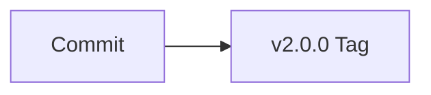
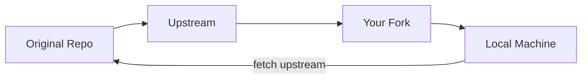
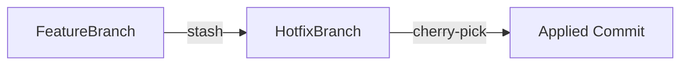
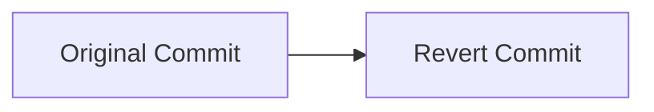
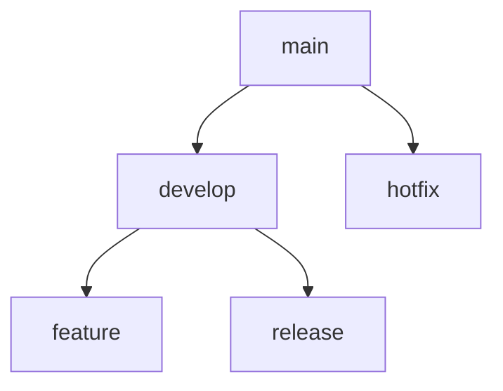
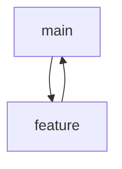
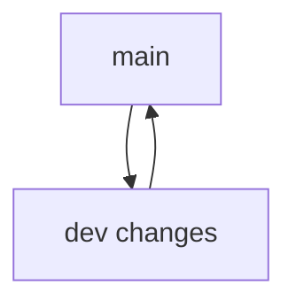

# ✅ `challenge_solution.md` 

# Day 4: Advanced Git Mastery

**Name:** Manjunath K  
**Date:** 13 September 2025  

---

## ✅ Task 1 – Amend a Commit

### Commands used:
```bash
Adding multiple commits
```

### Screenshot:


### Diagram:
```mermaid
flowchart TD
    A[Initial commit] --> B[Staged changes]
    B --> C[Amended commit]

---

## ✅ Task 2 – Interactive Rebase

### Screenshot:


### Diagram:
```mermaid
flowchart LR
    A[Change 1] --> B[Change 2]
    B --> C[Change 3]
    D[Rebase] --> E[Squash Commits 2 & 3]
    E --> F[Final Commit]
```

### Result:
The last two commits were combined into one, with the new commit message updated accordingly. The commit history is cleaner and easier to understand.


---

## ✅ Task 3 – Tag a Release

### Commands used:
```bash
git tag -a v2.0.0 -m "Release version 2.0.0"
git push origin --tags
git tag v1.0.0 # Lightweight
```

### Screenshot:


### Diagram:


### Result:
A new annotated tag `v2.0.0` was created with a description and pushed to GitHub.

---

## ✅ Task 4 – Sync with Upstream

### Commands used:
```bash
git remote add upstream https://github.com/Sagar2366/LearnWithSagar.git
git fetch upstream
git merge upstream/main
```

### Screenshot:


### Diagram:


### Result:
The upstream repository's changes were successfully merged into the local repository without losing existing changes.

---

## ✅ Task 5 – Stash and Cherry-Pick

### Commands used:
```bash
echo "Stash content" >> file.txt
git add file.txt

git stash

git checkout -b hotfix

random lines for cherry pick

git cherry-pick <commit-hash>   # Replace <commit-hash> with actual commit ID

git stash pop
```

### Screenshot:


### Diagram:


### Result:
Uncommitted changes were safely stored using `git stash`, applied to another branch using `git cherry-pick`, and then restored using `git stash pop`.

---

## ✅ Task 6 – Reset

### Commands used:
```bash
git reset --soft HEAD~1
git reset --mixed HEAD~1
git reset --hard HEAD~1
```

### Diagram:
flowchart TD
    subgraph Soft["git reset --soft"]
        H1[HEAD → Moves to target commit]
        I1[Index (Staging Area) → Keeps changes]
        W1[Working Directory → Keeps changes]
    end

    subgraph Mixed["git reset --mixed (default)"]
        H2[HEAD → Moves to target commit]
        I2[Index → Reset to commit (unstages changes)]
        W2[Working Directory → Keeps changes]
    end

    subgraph Hard["git reset --hard"]
        H3[HEAD → Moves to target commit]
        I3[Index → Reset to commit]
        W3[Working Directory → Discards changes]
    end


### Result:
The feature branch was rebased onto the main branch, conflicts were resolved, and the history is now linear.
git soft:


git mixed:


git hard:


---

## ✅ Task 7 – Undo with Revert

### Commands used:
```bash
git revert <commit-hash>   # Replace <commit-hash> with actual commit ID

git log --oneline
```

### Screenshot:


### Diagram:


### Result:
A new commit was created that undoes the changes introduced by the specified commit, keeping history safe and intact.

---

## ✅ Task 8 – Branching Strategies

### Gitflow
- Description: A structured workflow for teams with scheduled releases, using feature, release, and hotfix branches.



### GitHub Flow
- Description: A lightweight workflow where all work is done in feature branches and merged into main after review.



### Trunk-Based Development
- Description: Developers commit directly to the main branch, using feature toggles to manage incomplete features.



### Chosen Strategies

1. **For a small team with continuous deployment → GitHub Flow**
   **Reason:** It's simple, quick, and reduces overhead while allowing fast deployments.

2. **For a large team with monthly releases → Gitflow**
   **Reason:** It offers a controlled environment with multiple branches that suit scheduled releases and better quality assurance.

---


---

## ✅ Submission Checklist

- ✅ Completed all tasks with commands and explanations
- ✅ Added diagrams for each workflow
- ✅ Inserted screenshots under each command block
- ✅ Pushed code to GitHub
- ✅ Created PR titled **Day 4: Advanced Git Mastery**
- ✅ Shared on LinkedIn with hashtags: `#getfitwithsagar #DevOpsForAll`

---
